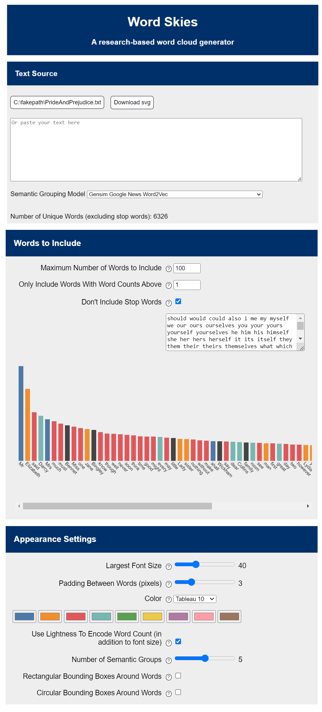

# WordCloudGenerator

### Overview
A word cloud is a data visualization that encodes information about a text in the words themselves, often using a subset of the most common words to compare relative frequencies. Word clouds are one of the most user-friendly ways to visualize a text corpus — you can extract an interesting, engaging visualization with just a simple copy and paste! They have applications in education, journalism, data analysis, and the digital humanities and are even used in such prominent places as the New York Times. 

Word clouds are popular, but they easily become less effective when font size, rotation, and color are misused, and, additionally, because of perceptual biases that are inherent in a visualization like this. Our research group at Carleton College (Northfield, MN) decided to create a research-based word cloud generator, choosing features that would target specific biases common in word clouds. Our tool includes features such as the capability of controlling maximum font size and padding, editing a list of stop words, and specifying a color scheme, among others. We also include the ability to use lightness along with font size as a redundant encoding on word frequency, to split words into semantic groups, and to add either rectangular or circular bounding boxes around individual words.

### How to Run Our Code

Our project uses the Flask module, and so the the program is launched using the wordcloud.py file, located in the root folder. Run this file (using the command `python wordcloud.py`) and you should receive a URL which you can paste into your browser to view our page locally hosted.

### Using the d3-cloud Library and Creating Clouds

The basis for our word cloud generator is [Jason Davies' d3-cloud javascript library](https://github.com/jasondavies/d3-cloud), which, in turn, is built using [D3](https://d3js.org/), a data visualization library for javascript. d3-cloud allowed us to feed in words and their font sizes and then placed them in a spiral shape (as is common with word clouds) without collisions. By looking at individual pixels, d3-cloud allowed us to closely pack words in the empty spaces left over and took care of what would otherwise have been tricky collision detection.

d3-cloud was very helpful for basic placing of the words, but there was still a lot of data preparation involved (getting user settings and reacting to them, counting the frequencies of each word in the text, calculating font size based on their frequency, and determining semantic groups), as well as work afterwards (transferring the coordinates given by d3-cloud into actual svg graphics, placing multiple clouds without them colliding when semantic groups are used, and adding in our own features like bounding boxes and lightness).

### Our Features

A word cloud with semantic grouping:

A word cloud with semantic grouping and rectangular bounding boxes:

A word cloud with semantic grouping and circular bounding boxes:

Based on our research, we decided to use a redundant encoding of font size and lightness to make comparisons of the relative frequency of words easier. To do this, we used D3’s built-in scales, which allowed us to specify an input domain (for example, from 1 to the highest frequency in the current text) and receive a scaled output in the range we specified (for example, a font size between 10 and 40). In order to create an output range for lightness, we converted the user’s chosen color from the standard rgb (red, green, blue) format to hsl (hue, saturation, lightness). We decided to always scale the lightness between .8 and .4 to ensure that the small and big words would still be readable no matter the lightness of the original color the user chose.

We decided to implement options for both rectangular bounding boxes, like the ones previously tested, and circular bounding boxes similar to a bubble chart. These had sizes proportioned based on the frequency or font size of words, so that all words of the same frequency had the same size bounding boxes and they could be more accurately compared.

We used [Sharon Choong's library](https://github.com/sharonchoong/svg-exportJS) to allow the user to download their cloud as an .svg file.

Semantic grouping is based on k-means clustering of a [word vector dataset that is pre-trained using Google News articles](https://github.com/stevemacn/kmeans) (10,000 most common words), with clouds placed as small multiples. We fed each semantic group to d3-cloud separately to place as if it were its own cloud, and then we placed each small cloud. We used D3’s force simulation to pack the smaller clouds as close together as possible while avoiding collisions. 

### The Web Interface

The main logic of our program was written using Javascript, but our website interface was written in HTML and CSS, using Python’s Flask module. Our interface allows for file input and copy/paste raw text input. We included many different settings that the user can specify, such as the maximum number of words in the cloud, font size, a stop words list, the number of semantic groups, and color. The user can also view the words not included in their cloud with their frequencies, along with being able to download the word cloud as a svg file.

Our code is modularized so that our basic word cloud generator functionality can be used on its own without our interface, such as by importing it into Observable Notebooks (observablehq.com). In order to import our code into Observable, we had to learn how to make sure it met the Asynchronous Module Definition (AMD) specification, a specific organizational format that is required by Observable.

### Future Improvements:
- Allow user to choose semantic grouping algorithm and training dataset used for semantic grouping
- Dynamically update cloud without having to fully regenerate it each time
- Improve user interface
- Host tool on Observable Notebooks
